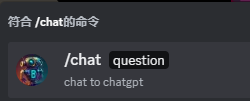

# chatgpt-bot

a discord chagpt bot

## .env.production

```yml
APPLICATION="YOUR-APPLICATION-ID"
TOKEN="YOUR-BOT-TOKEN"
SERVERS="THE-GUIDS-YOUR-WANT-TO-USE-CHATGPT"
CHATGPT="CHATGPT-TOKEN"
```

## docker

```
git pull && docker compose build && docker compose up -d
```

## How to use in a discord.Server



## How to use in DM

just ask the question
